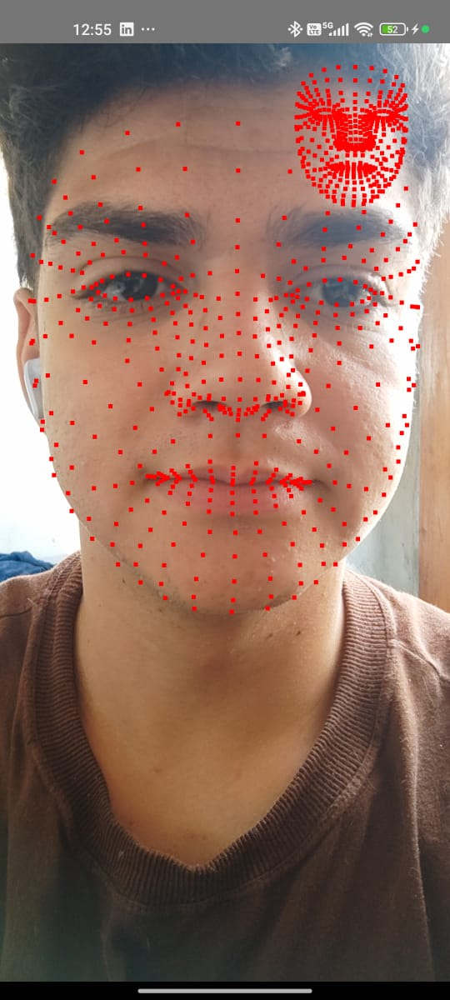
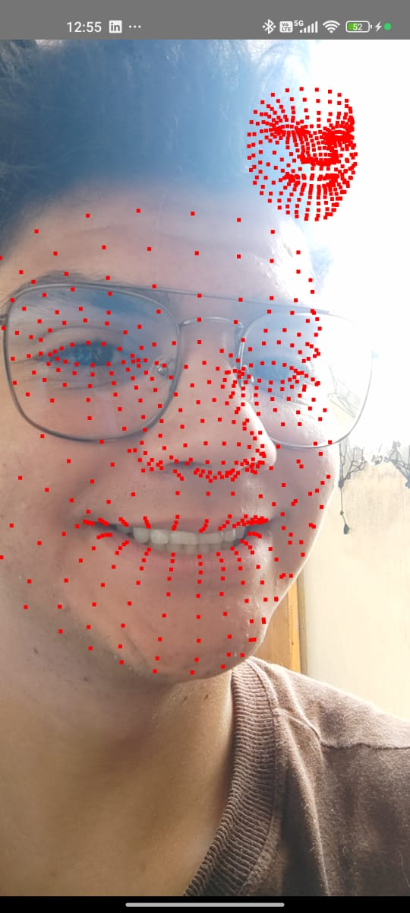

# Face Mesh Visualization

Este projeto utiliza Jetpack Compose para desenhar e visualizar pontos faciais detectados a partir de uma malha facial (Face Mesh). O sistema aplica transformações como espelhamento horizontal e escalonamento para exibir corretamente os pontos faciais detectados.

## 📌 Tecnologias Utilizadas

- Kotlin
- Jetpack Compose
- ML Kit do Google
- Navigation
- MVVM, Clean Architecture
- CameraX
- AndroidX Lifecycle
- Coroutines e Flow

## 🚀 Funcionalidades

- Leitura e renderização de malha facial (Face Mesh).
- Aplicação de escala proporcional.
- Espelhamento horizontal para simulação de câmera frontal.
- Gerenciamento de permissões de câmera no Android.

## 📷 Screenshots

 

## 🎥 Demonstração

https://github.com/user-attachments/assets/51b36627-5a39-4ccb-b38d-0a9ab498c0a0

